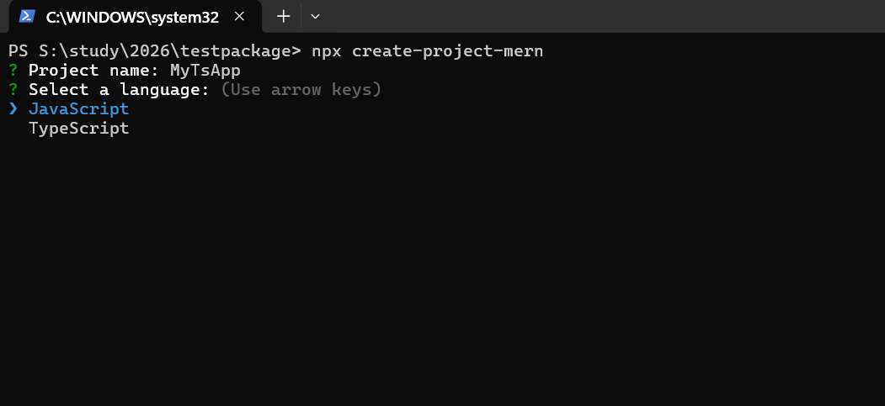
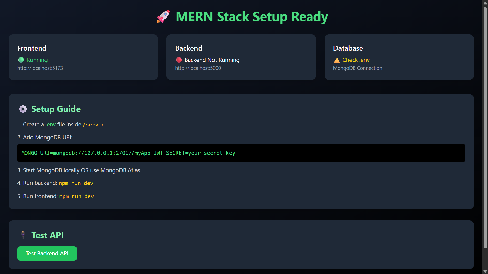
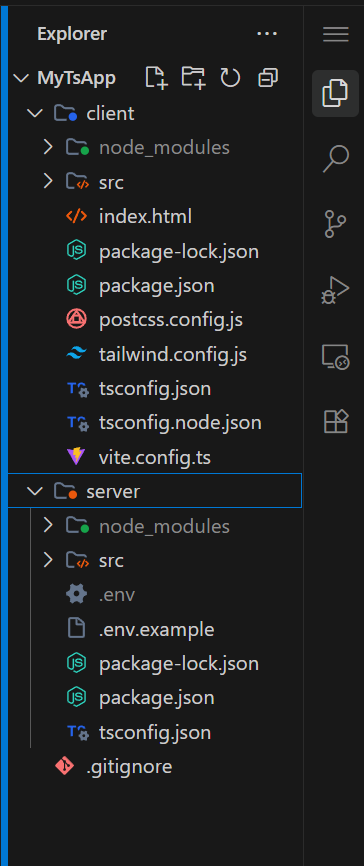
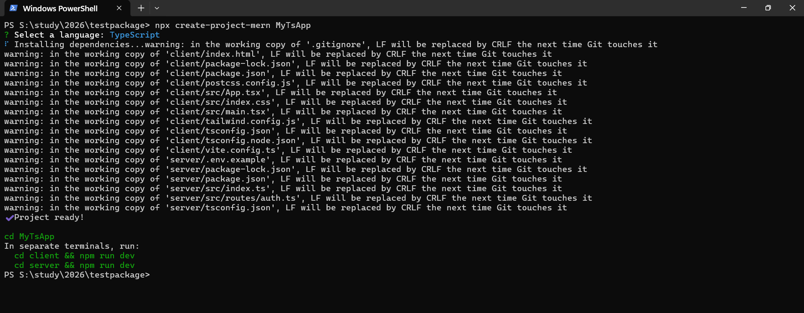

<div align="center">
  <h1>🚀 Create Project MERN</h1>
  <p><strong>Create production-ready MERN apps in seconds</strong></p>

  <p>
    <a href="https://www.npmjs.com/package/create-project-mern"></a>
    <a href="https://www.npmjs.com/package/create-project-mern"></a>
    <a href="https://github.com/TusharGujjanwar/create-project-mern"></a>
    <a href="https://nodejs.org"></a>
    <a href="https://opensource.org/licenses/MIT"></a>
  </p>
</div>

<br />

A production-ready MERN stack scaffolding CLI tool that instantly generates full-stack MERN boilerplate applications with JavaScript or TypeScript support.

> **Note:** This tool is NOT a tutorial. Users only need to run one command, select options, and their project is ready automatically. No manual React, Express, MongoDB, Vite, Tailwind, or TypeScript setup required.

---

## ✨ Features

- 📦 **MERN Stack Boilerplate** - Pre-configured and ready to use.
- 🔠 **JavaScript + TypeScript Support** - Choose your preferred language.
- ⚡ **Vite Frontend** - Blazing fast frontend build tool.
- 🚂 **Express Backend** - Robust backend server.
- 🍃 **MongoDB Ready** - Database connection pre-configured.
- 🎨 **TailwindCSS Setup** - Instant styling with Tailwind (optional).
- 🔐 **Authentication Ready** - JWT Auth Support included.
- ⬇️ **Auto Dependency Installation** - Sit back while we install everything.
- 🐙 **Automatic Git Initialization** - Start tracking changes immediately.
- 🏗️ **Production Ready Structure** - Clean and scalable folder structure.
- 🖥️ **Modern UI Starter** - Beautiful starting dashboard.
- ⚙️ **Environment Variables Included** - `.env` templates ready to go.
- 🩺 **Ready-to-use Backend Health Check API** - Built-in status checks.

---

## 🚀 Installation

You can install the package globally:

```bash
npm install -g create-project-mern
```

But **npx is recommended** to always use the latest version:

```bash
npx create-project-mern myApp
```

---

## 💻 Usage

Running the CLI is simple. Just use the `npx` command followed by your project name.

```bash
npx create-project-mern myApp
```

### Example Flow

```bash
$ npx create-project-mern myApp

🚀 Welcome to Create Project MERN!
? What is your project named? myApp
? Do you want to use TypeScript? Yes
? Do you want to include TailwindCSS? Yes
? Do you want to include JWT Authentication? Yes

⚙️  Setting up your project...
📦 Installing dependencies...
🐙 Initializing Git repository...

✅ Project myApp created successfully!
```

---

## 📂 Generated Project Structure

```text
myApp/
├── client/          # Frontend React + Vite app
├── server/          # Backend Express app
├── .gitignore
└── package.json
```

- **`client`** → The frontend application, pre-configured with Vite, React, and optional TailwindCSS.
- **`server`** → The backend application, pre-configured with Express, MongoDB connection, and optional JWT authentication.

---

## 🛠️ Included Features

When you generate a project, it automatically comes configured with:

- **React + Vite**: Fast, modern frontend setup.
- **Express Server**: RESTful API ready backend.
- **MongoDB Setup**: Mongoose connection logic pre-written.
- **Environment Variables**: `.env` files for both client and server.
- **TailwindCSS**: Ready to use utility classes (if selected).
- **JWT Auth**: User authentication boilerplate (if selected).
- **Backend Health API**: Ready `/api/health` endpoint to verify backend status.
- **Git Repo Initialization**: `git init` and initial commit automatically done.
- **Dependency Installation**: All `npm install` commands run during setup.

---

## 📸 Screenshots

### CLI Preview
*Add your CLI setup screenshot here*
<!--  -->

### Generated App UI
*Add your generated App UI screenshot here*
<!--  -->

### Folder Structure
*Add your folder structure screenshot here*
<!--  -->

### Terminal Setup
*Add your terminal setup screenshot here*
<!--  -->

---

## 🏃‍♂️ Running The App

Navigate to your project directory and start both servers.

**Start the Frontend:**
```bash
cd myApp/client
npm run dev
```
> Frontend runs at → **`http://localhost:5173`**

**Start the Backend:**
```bash
cd myApp/server
npm run dev
```
> Backend runs at → **`http://localhost:5000`**

---

## 🌟 Example Generated UI

The generated starter dashboard includes:
- **Frontend Status**: Indicates if the React app is running correctly.
- **Backend Status**: Real-time ping to the backend health API.
- **MongoDB Status**: Shows if the database connection is successful.
- **API Test Button**: Quick button to test API interactions.
- **Setup Guide Section**: Next steps to customize your application.

---

## 🤔 Why Use This Package?

- ⏱️ **Saves Setup Time**: Go from idea to coding in seconds.
- 🚫 **No Manual Configuration**: Skip the tedious setup of Webpack, Babel, Vite, Mongoose, etc.
- 🏢 **Production-ready Boilerplate**: Best practices baked in from the start.
- 🧹 **Clean Architecture**: Separation of concerns between client and server.
- 👶 **Beginner Friendly**: Simple prompts, no complex flags required.
- ⚡ **Fast Setup**: Automated dependency installation and git init.

---

## 📋 Requirements

- Node.js >= 18
- npm installed
- MongoDB (optional, but recommended for the backend)

---

## 📝 License

This project is licensed under the MIT License - see the [LICENSE](LICENSE) file for details.

---
<div align="center">
  <b>Built with ❤️ by <a href="https://github.com/TusharGujjanwar">Tushar Gujjanwar</a></b>
  <br />
  <br />
  <a href="https://www.npmjs.com/package/create-project-mern">npm package</a> • <a href="https://github.com/TusharGujjanwar/create-project-mern">GitHub Repository</a>
</div>
